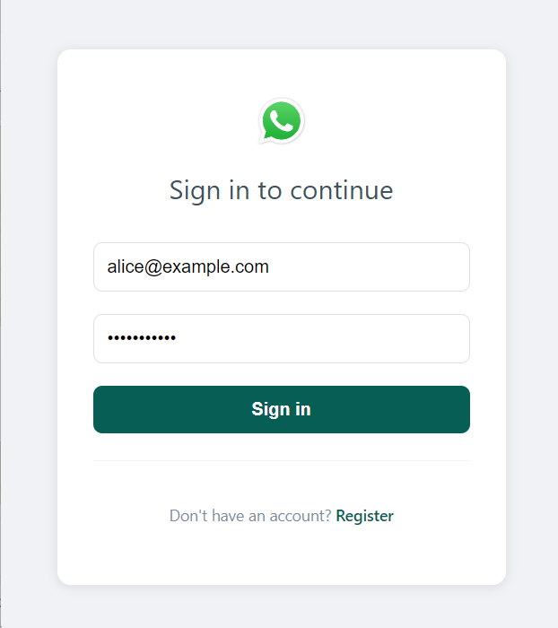
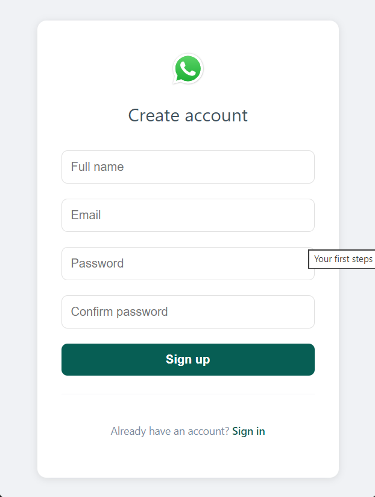
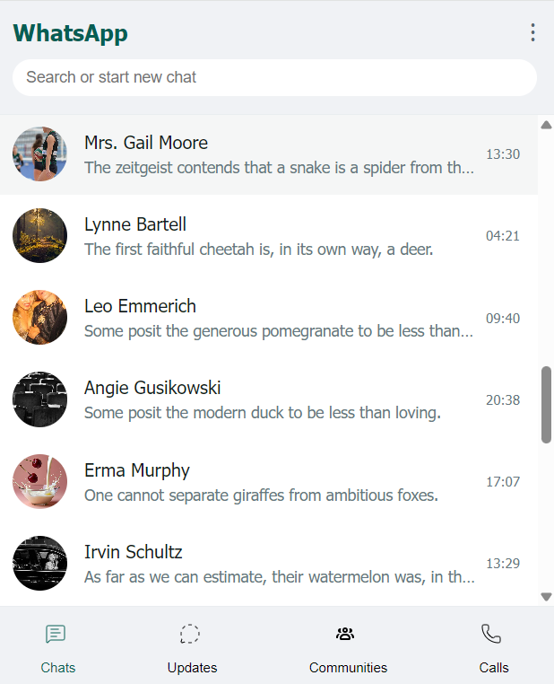
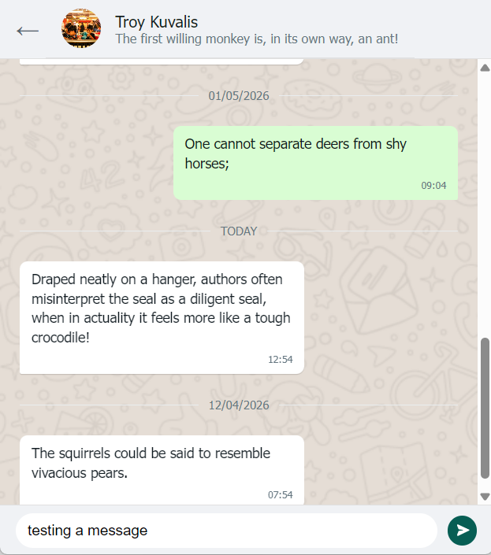

# Messaging App Prototype - Whatsup-like-messaging

A front-end demo exploring a modern instant messaging interface built with React and Redux. This application uses mock data to simulate a complete chat experience, including user contacts, message threads, and real-time typing indicators. It's a practical showcase of state management and the classic messaging UI, built with a modern toolchain and deployed on GitHub Pages.\*

# screen shot

## ✨ Key Features

- **💬 Contact List & Chat Simulation** – Select a contact to view your message history. All conversations are pre-loaded for instant access.
- **⌨️ Typing Indicator** – A realistic simulation of the "other user is typing" message for an authentic chat feel.
- **👤 Randomized Mock Data** – A contact list of 35 users is dynamically generated, each with a name, email, profile picture, and a random status.
- **🚀 Deployed Live** – The app is live at [https://adnenre.github.io/messaging-app/](https://adnenre.github.io/messaging-app/)

## ⚙️ Technology Stack

- **Front-End**: React (v16.3.2), Redux (v4.0.0), vanilla CSS
- **Mock Data Generation**: `@faker-js/faker` (v7.6.0), `txtgen`
- **Build Tool**: Create React App (v2.1.1)
- **Deployment**: GitHub Pages via `gh-pages` package

## 🧪 How the Mock Data Works

All data is generated client‑side – no backend required.

- **Users** – `generateUser()` creates each user using `faker.person.fullName()`, `faker.image.avatar()`, and a random status from `txtgen`.
- **Messages** – For each active user, a conversation is generated with random sentences (`txtgen`) and a boolean flag (`is_user_msg`) to indicate the sender.
- **State Management** – All mock data is centralised in `src/static-data.js`, making it easy to modify.

## 🚀 Getting Started Locally

1. Clone the repository  
   `git clone https://github.com/adnenre/messaging-app.git`
2. Navigate into the folder  
   `cd messaging-app`
3. Install dependencies  
   `npm install`
4. Start the development server  
   `npm start`

The app will open at `http://localhost:3000`.

## 🔧 Deploying to GitHub Pages

This project is pre‑configured to deploy to GitHub Pages.

1. Update the `homepage` field in `package.json` to your own GitHub Pages URL.
2. Run the deploy script:  
   `npm run deploy`

This builds the production version and pushes it to the `gh-pages` branch.

## 🛠 Customisation

- **Number of contacts** – Change `generateUsers(35)` in `src/static-data.js`
- **Messages per chat** – Adjust `getMessages(10)` inside the `state` object
- **Styling** – Modify CSS files inside `src/components/` and `src/containers/`

## 📝 Technical Note

The project uses `@faker-js/faker@^7.6.0` for compatibility with the legacy Webpack version in Create React App 2.x. All Faker calls use the modern API (`faker.person.fullName()`, `faker.image.avatar()`, `faker.datatype.boolean()`).

## 📄 License

MIT
